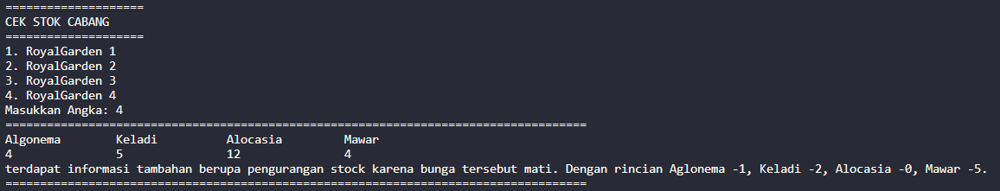

# Laporan Praktikum Pertemuan 1

## Praktikum Pemilihan

Hasil output dari Program Menghitung Nilai Akhir :

## Praktikum Perulangan

Hasil output dari Program Perulangan :

## Praktikum Array

Hasil output dari Program Menghitung IP Semester

## Praktikum Fungsi

Hasil output dari Program Toko Bunga

#### Pendapatan cabang

1. 
2. 
3. 
4. 

#### Stok bunga tiap cabang

1. 
2. 
3. 
4. 

## Tugas 1

Hasil output dari Program Plat Mobil

## Tugas 2

Hasil output dari Program JKW

 

 

