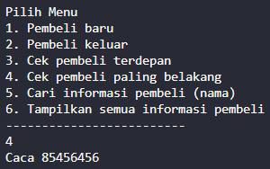

# Laporan Jobsheet 8 - Queue

```
Nama : Giovano Alkandri
Nim : 2341720096
Kelas : TI-1H
```

## Praktikum 1

### 8.1.1 Verifikasi Hasil Praktikum 1

**Contoh verifikasi hasil percobaan**

 

**Hasil Program**


### 8.1.2 Pertanyaan

1.  Pada konstruktor, mengapa nilai awal atribut front dan rear bernilai -1, sementara atribut size bernilai 0?

    > Hal tersebut dilakukan sebagai nilai default ketika tidak ada data berada dalam queue.

2.  Pada method Enqueue, jelaskan maksud dan kegunaan dari potongan kode berikut! 

    > Kode tersebut digunakna ketika data telah penuh, sehingga rear diubah menjadi 0 ( loncat ke depan ) agar sesuai dengan konsep queue.

3.  Pada method Dequeue, jelaskan maksud dan kegunaan dari potongan kode berikut! 

    > Kode tersebut digunakan ketika data yang tersimpan hanya 1 dan berada pada posisi terakhir dari penyimpanan ( max -1 ), sehingga front akan dikembalikan kembali ke index 0

4.  Pada method print, mengapa pada proses perulangan variabel i tidak dimulai dari 0 (int i=0), melainkan int i=front?

    > variabel i dimulai dari front karena data yang tersimpan pada queue dimulai dari front. Jika ada data yang dihapus, data yang terdepan lah yang dihapus terlebih dahulu sehingga tidaklah mungkin membuat i = 0.

5.  Perhatikan kembali method print, jelaskan maksud dari potongan kode berikut! 

    > Kode tersebut digunakan agar tidak terjadi infinite loop pada variable i, sehingga data yang ditampilkan sesuai dengan data yang berada pada penyimpanan.

6.  Tunjukkan potongan kode program yang merupakan queue overflow!

        if (isFull()) {
            System.out.println("Queue sudah penuh");

7.  Pada saat terjadi queue overflow dan queue underflow, program tersebut tetap dapat berjalan dan hanya menampilkan teks informasi. Lakukan modifikasi program sehingga pada saat terjadi queue overflow dan queue underflow, program dihentikan!

        Memodifikasi kode sehingga seperti di bawah ini

        Enqueue :
        if (isFull()) {
            System.out.println("Queue sudah penuh");
            System.exit(0);
        }

        Dequeue :
        if (isEmpty()) {
            System.out.println("Queue masih kosong");
            System.exit(0);
        }

## Praktikum 2

### 8.2.1 Verifikasi Hasil Praktikum 2

**Contoh verifikasi hasil percobaan**


**Hasil Program**


### 8.2.2 Pertanyaan

1. Pada class QueueMain, jelaskan fungsi IF pada potongan kode program berikut!     

    > Fungsi kode tersebut sebagai pengecualian ketika object yang direturn oleh method deQueue berisikan data yang kosong atau null sehingga tidak akan menampilkannya dan hnya akan menampiilkan obect yang memiliki data.

2. Lakukan modifikasi program dengan menambahkan method baru bernama peekRear pada class Queue yang digunakan untuk mengecek antrian yang berada di posisi belakang! Tambahkan pula daftar menu 5. Cek Antrian paling belakang pada class QueueMain sehingga method peekRear dapat dipanggil! 

    ```
     public void peekRear() {
        if (!isEmpty()) {
            System.out.println(
                    "Elemen terbelakang : " + data[rear].norek + " " + data[rear].nama + " " + data[rear].alamat
                            + " " + data[rear].umur + " " + data[rear].saldo);
        } else {
            System.out.println("Queue masih kosong");
        }
    }
    ```


### Tugas
Buatlah program antrian untuk mengilustasikan pesanan disebuah warung. Ketika seorang pembeli akan mengantri, maka dia harus mendaftarkan nama, dan nomor HP seperti yang digambarkan pada Class diagram berikut:  

   

  


====================================================================================
- Pembeli Baru  

    

- Pembeli Keluar

    

- Cek Pembeli terdepan

    

- Cek Pembeli paling belakang  

    

- Cari posisi pembeli  

    

- Tampilkan seluruh informasi pembeli  

    