# Laporan Jobsheet 9 - Linked LIst

```
Nama : Giovano Alkandri
Nim : 2341720096
Kelas : TI-1H
```

## Praktikum 1

### 9.1.1 Verifikasi Hasil Praktikum 1

**Contoh verifikasi hasil percobaan**

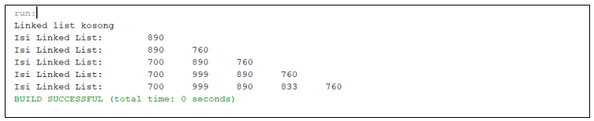

**Hasil Program**

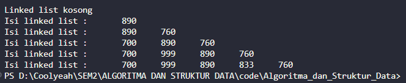

### 9.1.2 Pertanyaan

1. Mengapa hasil compile kode program di baris pertama menghasilkan “Linked List Kosong”?

   > Karena hal yang pertama dilakukan adalah menampilkan isi dari penyimpanan sehingga ketika tidak ada isinya akan menampikan "Lunked list kosong".

2. Jelaskan kegunaan variable temp secara umum pada setiap method!

   > Variabel temp secara umum digunakan untuk menyimpan data dari salah satu penyimpanan untuk dilakukan perpindahan node.

3. Perhatikan class SingleLinkedList, pada method insertAt Jelaskan kegunaan kode berikut 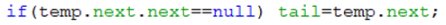

   > Kode tersebut digunakan untuk memastikan apakah node yang akan ditambah merupakan node terakhir, jika iya data akan diubah menjadi tail.

## Praktikum 2

### 9.2.1 Verifikasi Hasil Praktikum 2

**Contoh verifikasi hasil percobaan**

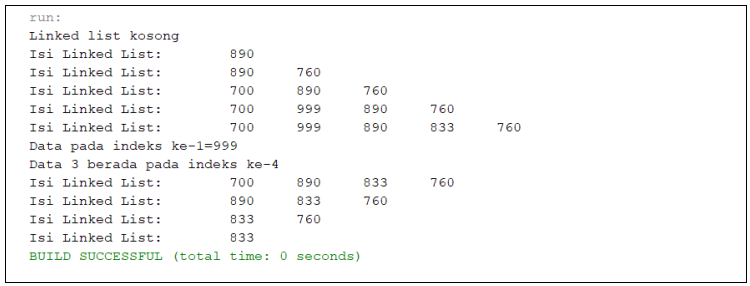

**Hasil Program**

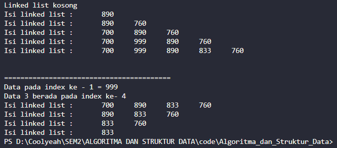

### 9.2.2 Pertanyaan

1. Mengapa digunakan keyword break pada fungsi remove? Jelaskan!

   > Break digunakan untuk berhenti melakukan looping setelah kondisi tertentu terpenuhi.

2. Jelaskan kegunaan kode dibawah pada method remove 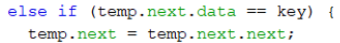

   > Kode tersebut digunakan ketika data selanjutnya merupakan key yang akan dihapus sehingga data tersebut akan ditimpa dengan data setelah key tersebut.

## Tugas - Membuat Program Layanan Unit Kemahasiswaan

1. Implementasikan ilustrasi Linked List Berikut. Gunakan 4 macam penambahan data yang telah
   dipelajari sebelumnya untuk menginputkan data 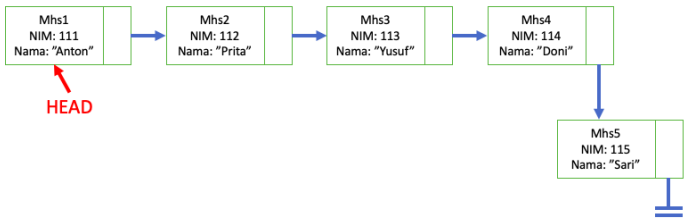

   ### Hasil Program Layanan Unit Kemahasiswaan Linked List

   1. Penambahan Antrian  
      1.1 Antrian Kosong

      

      1.2 Menambahkan antrian di depan

      ```
      mhs.tambahDepan(111, "Anton");
      ```

      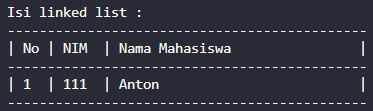

      1.3 Menambahkan antrian di paling belakang

      ```
      mhs.tambahBelakang(115, "Sari");
      ```

      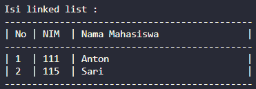

      1.4 Menambahkan antrian di belakang antrian yang ditentukan

      ```
      mhs.tambahSetelah(112, "Prita", 111);
      ```

      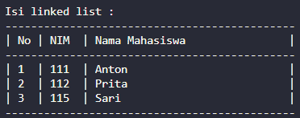

      1.5 Menambahkan antrian di posisi yang ditentukan

      ```
      mhs.tambahDimana(113, "Yusuf", 3);
      ```

      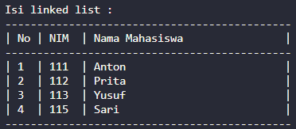

      1.6 Menambahkan antrian di belakang antrian yang ditentukan

      ```
      mhs.tambahSetelah(114, "Doni", 113);
      ```

      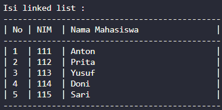

   2. Menampilkan informasi antrian tertentu

      ```
      System.out.println("Antrian pertama = " + mhs.getNim(1) + " |  " + mhs.getNama(1));
      ```

      

   3. Menampilkan mahasiswa berada pada antrian ke berapa

      ```
      System.out.println("Doni berada pada antrian ke - " + mhs.posisiKe(114));
      ```

      

   4. Menghapus antrian
      4.1 Menghapus antrian berdasarkan nim

      ```
      mhs.hapus(113);
      ```

      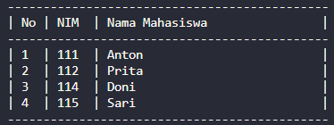

      4.2 Menghapus antrian berdasarkan posisi

      ```
      mhs.hapusDimana(2);
      ```

      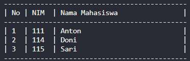

      4.3 Menghapus antrian paling depan

      ```
      mhs.hapusDepan();
      ```

      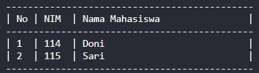

      4.4 Menghapus antrian paling belakang

      ```
      mhs.hapusBelakang();
      ```

      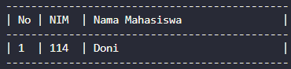

2. Buatlah implementasi program antrian layanan unit kemahasiswaan sesuai dengan kondisi yang ditunjukkan pada soal nomor 1! Ketentuan

   - Implementasi antrian menggunakan Queue berbasis Linked List!
   - Program merupakan proyek baru, bukan modifikasi dari soal nomor 1!

   ### Hasil Program Layanan Unit Kemahasiswaan Linked List

   1. Menambahkan antrian

      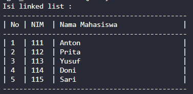

   2. Peek antrian terdepan

      

   3. Antrian setelah dequeue 2 antrian

      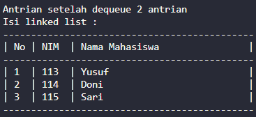
