# Laporan Jobsheet 10 - Double Linked Lists

```
Nama : Giovano Alkandri
Nim : 2341720096
Kelas : TI-1H
```

## 10.1 Praktikum 1

### 10.1.1 Verifikasi Hasil Percobaan

**Contoh verifikasi hasil percobaan**

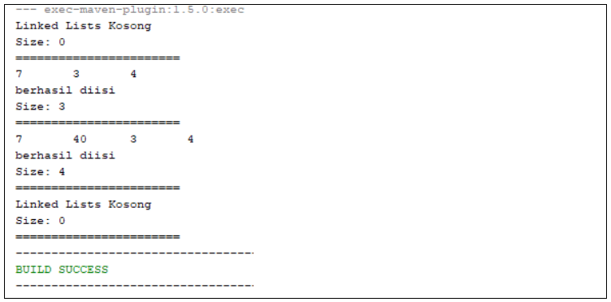

**Hasil Program**

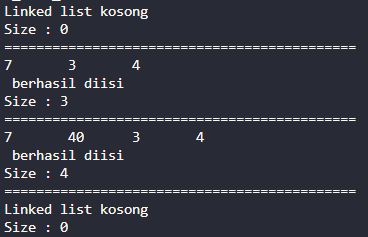

### 10.1.2 Pertanyaan

1. Jelaskan perbedaan antara single linked list dengan double linked lists!

   > Linked list hanya memiliki 1 penghubung ke node berikutnya. Sedangkan Double linked list memiliki 2 penghubung, yang pertama menyimpan node ke data previous dan yang ke dua menyimpan node ke data next

2. Perhatikan class Node, di dalamnya terdapat atribut next dan prev. Untuk apakah atribut tersebut?

   > Atribut tersebut digunakan untuk menyimpan node sebelum dan setelah data node saat ini

3. Perhatikan konstruktor pada class DoubleLinkedLists. Apa kegunaan inisialisasi atribut head dan size seperti pada gambar berikut ini?

   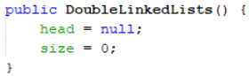

   > Inisiasi tersebut digunakan sebagai nilai default saat program double linked list dijalankan

4. Pada method addFirst(), kenapa dalam pembuatan object dari konstruktor class Node prev dianggap sama dengan null?

   ```
       Node newNode = new Node(null, item, head);
   ```

   > Karena dalam konsep Double Linked List mengharuskan node prev dari head menjadi null

5. Perhatikan pada method addFirst(). Apakah arti statement head.prev = newNode ?

   > Kode tersebut melakukan pemindahan input baru ke head.prev (sebelum head). lalu head lama akan dipindahkan ke head yang baru

6. Perhatikan isi method addLast(), apa arti dari pembuatan object Node dengan mengisikan parameter prev dengan current, dan next dengan null?

   ```
   Node newNode = new Node(current, item, null);
   ```

   > Kode tersebut menunjukan bahwa data tersebut merupakan data yang paling terakhir

7. Pada method add(), terdapat potongan kode program sebagai berikut:

   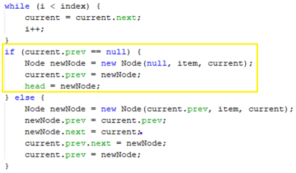

   jelaskan maksud dari bagian yang ditandai dengan kotak kuning.

   > Kode tersebut menunjukkan jika data sebelum current adalah null, maka akan dilakuakn kode seperti method addFirst

## 10.2 Praktikum 2

### 10.2.1 Verifikasi Hasil Percobaan

**Contoh verifikasi hasil percobaan**

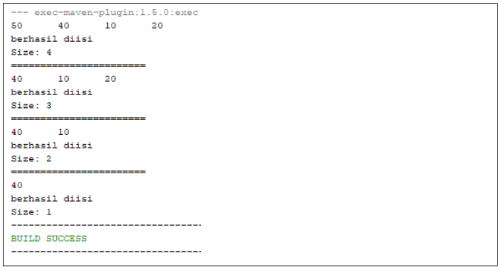

**Hasil Program**

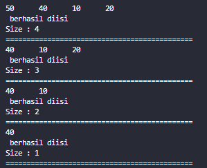

### 10.2.2 Pertanyaan

1. Apakah maksud statement berikut pada method removeFirst()?

   ```
   head = head.next;
   head.prev = null;
   ```

   > Statement tersebut digunakan untuk menggantikan nilai dari head.next ke dalam head, lalu head.prev diberikan nilai null

2. Bagaimana cara mendeteksi posisi data ada pada bagian akhir pada method removeLast()?

   > potongan kode di bawah ini merupakan cara mendeteksi posisi akhir data

3. Jelaskan alasan potongan kode program di bawah ini tidak cocok untuk perintah remove!

   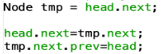

   > Karena tmp tidak diset menjadi null sehingga data yang akan dihapus masih tersiman

4. Jelaskan fungsi kode program berikut ini pada fungsi remove!

   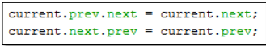

   > Pada baris 1 kode tersebut melakukan pemindahan node dari current.prev yang awalnya adalah current menjadi current.next. Lalu pada baris 2 melakukan pemindahan node current.next yang awalnya adalah current menjadi current.prev

## 10.3 Praktikum 3

### 10.3.1 Verifikasi Hasil Percobaan

**Contoh verifikasi hasil percobaan**

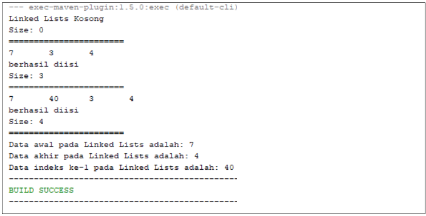

**Hasil Program**

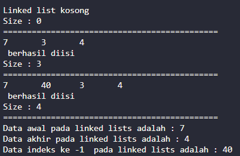

### 10.3.2 Pertanyaan

1. Jelaskan method size() pada class DoubleLinkedLists!

   > Method tersebut digunakan untuk mengembalikan niali dari size

2. Jelaskan cara mengatur indeks pada double linked lists supaya dapat dimulai dari indeks ke-1!

   > Hal tersebut dapat dilakukan seperti contoh pada method get. Ketika mengeksekusi method get, nilai yang diisikan adalah posisi dari data, bukan dari index. Lalu Ketika method get dijalankan pada kode looping, variable i dimulai dari 1 dan looping dijalankan selama i kurang dari index

3. Jelaskan perbedaan karakteristik fungsi Add pada Double Linked Lists dan Single Linked Lists!

   > Perbedaan karakteristik yang paling mencolok adalah perbedaan pada penambahan node yang dimana double linked list memiliki 2 node (prev dan next) sedangkan single linked list hanya memiliki 1 node (next)

4. Jelaskan perbedaan logika dari kedua kode program di bawah ini!

   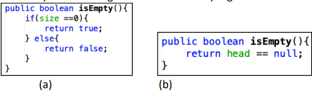

   > Pada gambar (a), method melakukan pengecekan apabila size adalah 0 akan mengembalikan nilai true, jika tidak maka akan mengembalikan nilai false. Sedangkan pada gambar (b), hanya mengembalikan apakah nilai head adalah null

## Tugas Praktikum

1. Buat program antrian vaksinasi menggunakan queue berbasis double linked list

   1.1 Menu Awal dan Penambahan Data

   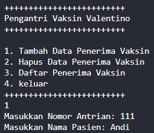

   1.2 Cek data

   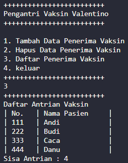

   1.3 Hapus Data

   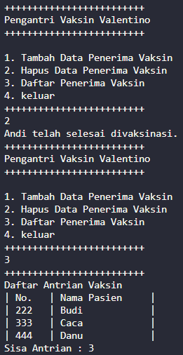

2. Buatlah program daftar film yang terdiri dari id, judul dan rating menggunakan double linked lists, bentuk program memiliki fitur pencarian melalui ID Film dan pengurutan Rating secara descending. Class Film wajib diimplementasikan dalam soal ini.

   2.1 Menu Awal dan Penambahan Data

   - Tambah Data Awal

     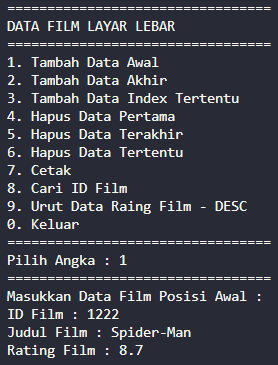

   - Tambah Data Akhir

     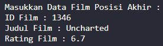

   - Tambah Data posisi tertentu

     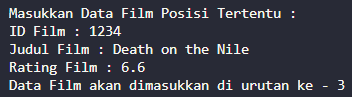
  
   2.2 Cetak Data

     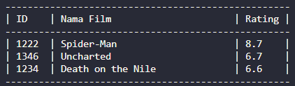

   2.3 Cari ID Film

     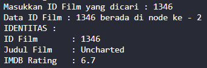

   2.4 Sorting

     - Sebelum Sorting

       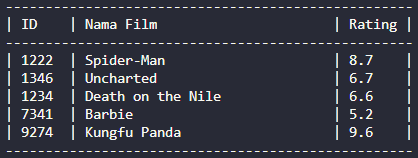

     - Setelah Sorting

       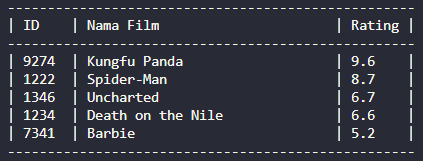

   2.5 Penghapusan Data  

      - Hapus data pertama  

         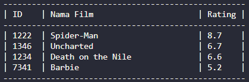

      - Hapus data terakhir  

         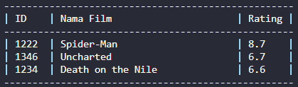

      - Hapus data posisi tertentu (posisi 2)

         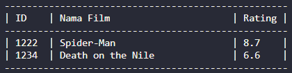
