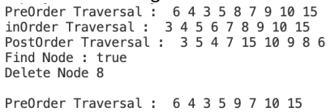
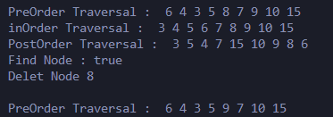
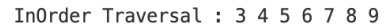
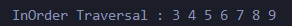
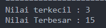
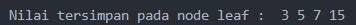
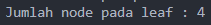
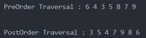

# Laporan Jobsheet 13 - Tree

```
Nama : Giovano Alkandri
Nim : 2341720096
Kelas : TI-1H
```

## Praktikum 1

### 13.1.1 Verifikasi Hasil Praktikum 1

**Contoh verifikasi hasil percobaan**



**Hasil Program**



### 13.1.2 Pertanyaan

1. Mengapa dalam binary search tree proses pencarian data bisa lebih efektif dilakukan dibanding binary tree biasa?

   > Karena binary search tree mempunyai bentuk khusus yaitu dengan sifat bahwa semua left-child harus lebih kecil daripada right-child dan parent-nya

2. Untuk apakah di class Node, kegunaan dari atribut left dan right?

   > Atribut left dan right digunkana untuk mengakses child kiri dan kanan

3. a. Untuk apakah kegunaan dari atribut root di dalam class BinaryTree?

   > root digunkana sebagai pointer pertama dan paling atas dari tree

   b. Ketika objek tree pertama kali dibuat, apakah nilai dari root?

   > null

4. Ketika tree masih kosong, dan akan ditambahkan sebuah node baru, proses apa yang akan terjadi?

   > root akan diisi dengan node baru

5. Perhatikan method add(), di dalamnya terdapat baris program seperti di bawah ini. Jelaskan secara detil untuk apa baris program tersebut?

   ```java
       if(data<current.data){
           if(current.left!=null){
               current = current.left;
           }else{
               current.left = new Node(data);
               break;
           }
       }
   ```

   > Dilakukan cek data yang akan ditambahkan apakah kurang dari data saat ini. lalu jika ya, cek apakah child kiri tidak null.
   >
   > 1. jika tidak null, "current" akan berpindah ke child kiri dari data saat ini.
   > 2. jika null, child kiri dari data saat ini akan diisi dengan node baru dan kode berhenti.

## Praktikum 2

### 13.21.1 Verifikasi Hasil Praktikum 2

**Contoh verifikasi hasil percobaan**



**Hasil Program**



### 13.2.2 Pertanyaan

1. Apakah kegunaan dari atribut data dan idxLast yang ada di class BinaryTreeArray?

   > Atribut data digunakna untuk menyimpan data/value, sedangkan idxLast adalah index terakhir yang disimpan dari data.

2. Apakah kegunaan dari method populateData()?

   > Method tersebut digunakan untuk input nilai pada 'data' dan mengatur posisi terakhir data

3. Apakah kegunaan dari method traverseInOrder()?

   > Method tersebut digunakna untuk menelusuri data pada tree dan akan di print dalam urutan left root right

4. Jika suatu node binary tree disimpan dalam array indeks 2, maka di indeks berapakah posisi left child dan rigth child masin-masing?

   > Jika index mulai dari 0,  
   > maka child kuru dari node 2 berada di indeks ke = 2i+1 = 2(2)+1 = 5  
   > dan child kanan dari node 2 berada di indeks ke = 2i+2 = 2(2)+2 = 6

5. Apa kegunaan statement int idxLast = 6 pada praktikum 2 percobaan nomor 4?

   > Statement tersebut digunakan untuk menyimpan nilai 6 pada atribut idxLast, sehingga nilai yang akan di tampilakn ada 7 (0-6).

## Tugas Praktikum

1. Buat method di dalam class BinaryTree yang akan menambahkan node dengan cara rekursif.

   ```
       void addRekur(int data) {
       root = Rekur(root, data);
   }

   private Node13 Rekur(Node13 current, int data) {
       if (current == null) {
           return new Node13(data);
       }

       if (data < current.data) {
           current.left = Rekur(current.left, data);
       } else if (data > current.data) {
           current.right = Rekur(current.right, data);
       }
       return current;
   }

   ```

2. Buat method di dalam class BinaryTree untuk menampilkan nilai paling kecil dan yang paling besar yang ada di dalam tree.

   ```
    int findMin() {
       if (isEmpty()) {
           System.out.println("Tree kosong");
       }
       Node13 current = root;
       while (current.left != null) {
           current = current.left;
       }
       return current.data;
   }

   int findMax() {
       if (isEmpty()) {
           System.out.println("Tree kosong");
       }
       Node13 current = root;
       while (current.right != null) {
           current = current.right;
       }
       return current.data;
   }
   ```

   

3. Buat method di dalam class BinaryTree untuk menampilkan data yang ada di leaf.

   ```
       void PrintValueLeaf(Node13 node) {
       if (node != null) {
           if (node.left == null && node.right == null) {
               System.out.print(" " + node.data);
           }
           PrintValueLeaf(node.left);
           PrintValueLeaf(node.right);
       }
   }
   ```

   

4. Buat method di dalam class BinaryTree untuk menampilkan berapa jumlah leaf yang ada di dalam tree.

   ```
   int HitungJumLeaf(Node13 node) {
       if (node == null) {
           return 0;
       }
       if (node.left == null && node.right == null) {
           return 1;
       }
       return HitungJumLeaf(node.left) + HitungJumLeaf(node.right);
   }
   ```

   

5. Modifikasi class BinaryTreeArray, dan tambahkan :  
   • method add(int data) untuk memasukan data ke dalam tree

   ```
       void add(int nilai) {
       if (idxLast < data.length - 1) {
           idxLast++;
           data[idxLast] = nilai;
       } else {
           System.out.println("Tree penuh");
       }
   }
   ```

   • method traversePreOrder() dan traversePostOrder()

   ```
   void traversePreOrder(int idxStart) {
       if (idxStart <= idxLast) {
           System.out.print(data[idxStart] + " ");
           traversePreOrder(2* idxStart+1);
           traversePreOrder(2*idxStart+2);
       }
   }

   void traversePostOrder(int idxStart) {
       if (idxStart <= idxLast) {
           traversePostOrder(2*idxStart+1);
           traversePostOrder(2*idxStart+2);
           System.out.print(data[idxStart] + " ");
       }
   }
   ```

   
