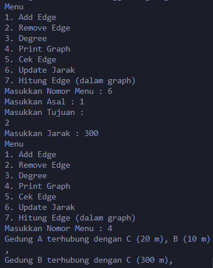

# Laporan Jobsheet 14 - Graph

```
Nama : Giovano Alkandri
Nim : 2341720096
Kelas : TI-1H
```

## Praktikum 1

### 14.1.1 Verifikasi Hasil Praktikum 1

**Verifikasi hasil percobaan langkah 14**


**Verifikasi hasil percobaan langkah 17**

=

### 14.1.2 Pertanyaan

1. Perbaiki kode program Anda apabila terdapat error atau hasil kompilasi kode tidak sesuai!

   > pada method addFirst diberikan atribut 'size++' pada akhir kode agar size bertambah 1 setiap data baru ditambahkan.

2. Pada class Graph, terdapat atribut list[] bertipe DoubleLinkedList. Sebutkan tujuan pembuatan variabel tersebut!

   > Variabel ini digunakan untuk menyimpan list tetangga dari graph, dimana setiap elemen dalama array merepresentasikan vertex dalam graph dan menyimpan daftar vertex tetangga yang terhubung

3. Jelaskan alur kerja dari method removeEdge!

   > Alur dari removeEdge ialah semua vertex diiterasi, mengecek apakah index iterasi sama dengan vertex 't', dan jika sama maka vertex 't' akan dihapus dari daftar tetangg vertex 'a'

4. Apakah alasan pemanggilan method addFirst() untuk menambahkan data, bukan method add jenis lain saat digunakan pada method addEdge pada class Graph?

   > Dalam menggunakan method AddFirst dalam penambahan data, kita mendapatkan efisiensi waktu karena data ditambahkan di awal secara langsung, method ini juga cara yang sederhana karena tidak perlu memeriksa posisi atau kondisi lain di dalam list dan yang pasti tidak perlu melakukan traversing untuk menambahkan data baru sehingga dapat mengurangi komplesitas dan potensi error dalam pengelolaan refrensi node prev dan node next

5. Modifikasi kode program sehingga dapat dilakukan pengecekan apakah terdapat jalur antara suatu node dengan node lainnya, seperti contoh berikut (Anda dapat memanfaatkan Scanner)  
   

   > Hasil modifikasi

   

## Praktikum 2

### 14.2.1 Verifikasi Hasil Praktikum 2

**Contoh verifikasi hasil percobaan**


### 14.2.2 Pertanyaan

1. Perbaiki kode program Anda apabila terdapat error atau hasil kompilasi kode tidak sesuai!

   > Pada method removeEdge, kode 'matrix[a][t] = -1' diubah menjadi 'matrix[a][t] = 0' agar ketika ditampilkan dapat tertampil semua

2. Apa jenis graph yang digunakan pada Percobaan 2?

   > Graph yang digunakan ialah graph Matrix

3. Apa maksud dari dua baris kode berikut?  
   

   > Maksud dari 2 baris kode tersebut menandakan bahwa graph tersetbu merupakan graph directed(berarah), setiap sisi nya memiliki arah. Pada vertex 1 ke vertex 2 ber jarak 70, dan vertex 2 ke vertex 1 berjarak 80

4. Modifikasi kode program sehingga terdapat method untuk menghitung degree, termasuk inDegree dan outDegree!

   

### Latihan Praktikum

1. Modifikasi kode program pada class GraphMain sehingga terdapat menu program yang bersifat dinamis, setidaknya terdiri dari:  
   a) Add Edge  
   b) Remove Edge  
   c) Degree  
   d) Print Graph  
   e) Cek Edge  
   Pengguna dapat memilih menu program melalui input Scanner
2. Tambahkan method updateJarak pada Percobaan 1 yang digunakan untuk mengubah jarak antara dua node asal dan tujuan!
3. Tambahkan method hitungEdge untuk menghitung banyaknya edge yang terdapat di dalam graf!

   ### Hasil Latihan Praktikum

   ***

   

   ***

   

   ***

   

   ***

   

   ***

   

   ***

   
