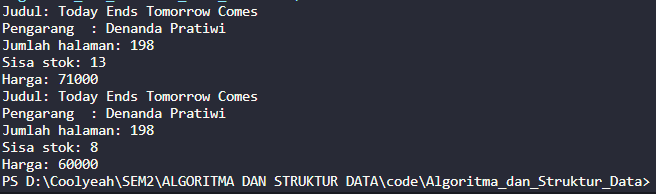
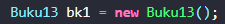
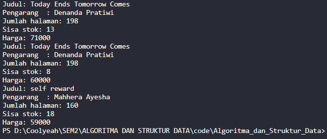
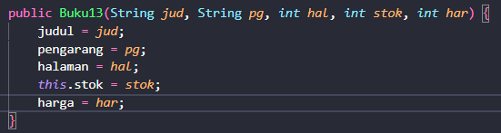
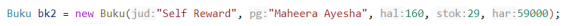
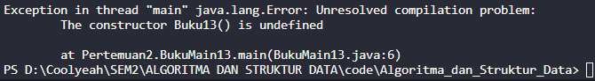
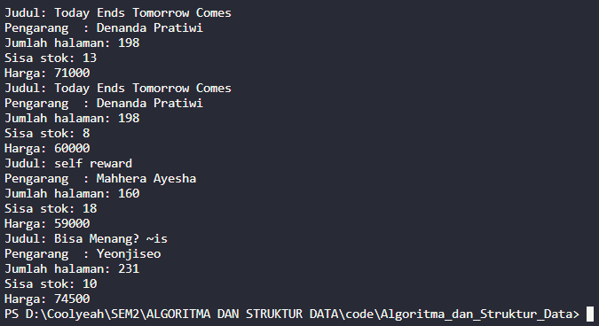
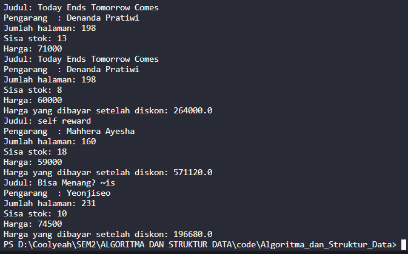
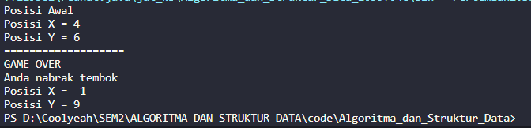

# Laporan Jobsheet 2

Nama : Giovano Alkandri  
Nim : 2341720096  
Kelas : TI-1H

## 2.1 Percobaan 1

#### Hasil Run Program

Tidak dapat dijalankan karena tidak memiliki class main sehingga tidak memiliki hasil Running.

### 2.1.1 Pertanyaan

1. Sebutkan dua karakteristik class atau object!  
   Jawab: Class atau Objek memiliki 2 karakteristik yaitu memiliki Atribut/Variable dan Method/Fungsi.
2. Perhatikan class Buku pada Praktikum 1 tersebut, ada berapa atribut yang dimiliki oleh class Buku? Sebutkan apa saja atributnya!  
   Jawab: Ada 5, judul: String, pengarang: String, halaman: int, stok: int, harga: int.
3. Ada berapa method yang dimiliki oleh class tersebut? Sebutkan apa saja methodnya!  
   Jawab: Ada 4, tampilInformasi(): void, terjual(jml: int): void, restock(n: int): void, gantiHarga(hrg: int): int.
4. Perhatikan method terjual() yang terdapat di dalam class Buku. Modifikasi isi method tersebut sehingga proses pengurangan hanya dapat dilakukan jika stok masih ada (lebih besar dari 0)!  
   Jawab: 
5. Menurut Anda, mengapa method restock() mempunyai satu parameter berupa bilangan int?  
   Jawab: Karena untuk melakukan restock hanya diperlukan jumlah buku nya saja dan berupa ber tipe data int.
6. Commit dan push kode program ke Github

## 2.2 Percobaan 2

#### Hasil Run Program



### 2.2.1 Pertanyaan

1. Pada class BukuMain, tunjukkan baris kode program yang digunakan untuk proses instansiasi! Apa nama object yang dihasilkan?  
   Jawab: , nama objek yang dihasilkan (bk1).
2. Bagaimana cara mengakses atribut dan method dari suatu objek?  
   Jawab: Cara mengakses atribut dengan cara (namaObjek.namaAtribut).
3. Mengapa hasil output pemanggilan method tampilInformasi() pertama dan kedua berbeda?  
   Jawab: Karena telah dilakukan pemanggilan method terjual() dan gantiHarga(), sehingga ketika dilakukan pemanggilan method tampilInformasi() informasi akan berubah.

## 2.3 Percobaan 3

#### Hasil Run Program



### 2.3.1 Pertanyaan

1. Pada class Buku di Percobaan 3, tunjukkan baris kode program yang digunakan untuk
   mendeklarasikan konstruktor berparameter!  
   Jawab: 
2. Perhatikan class BukuMain. Apa sebenarnya yang dilakukan pada baris program berikut?   
   Jawab: Kode tersebut melakukan instansiasi objek dengan parameter.
3. Hapus konstruktor default pada class Buku, kemudian compile dan run program. Bagaimana
   hasilnya? Jelaskan mengapa hasilnya demikian!  
   Jawab:   
   Terjadi error dikarenakan pada instansiasi objek bk1 tidak memiliki konstuktor karena baru saja dihapus.
4. Setelah melakukan instansiasi object, apakah method di dalam class Buku harus diakses
   secara berurutan? Jelaskan alasannya!  
   Jawab: Tidak, karena posisi method tidak mempengaruhi urutan kode dijalankan. Yang mempengaruhi urutan kode dijalankan ialah kapan method tersebut dipanggil.
5. Buat object baru dengan nama buku (NamaMahasiswa) menggunakan konstruktor
   berparameter dari class Buku!  
   Jawab: Kode
   ```
        Buku13 NamaMahasiswa = new Buku13("Bisa Menang? ~is", "Yeonjiseo", 231, 13, 74500);
        NamaMahasiswa.terjual(3);
        NamaMahasiswa.tampilInformasi();
   ```
   Hasil Run 
6. Commit dan push kode program ke Github

## 2.4 Latihan Praktikum

### 2.4.1 Buku

1.  Method hitungHargaTotal();

```
  int hitungHargaTotal() {
        int total = jml * harga;
        return total;
    }
```

2. hitungDiskon();

```
  double hitungDiskon() {
        int total = hitungHargaTotal();
        double diskon = 0;
        if (total > 150000) {
            diskon = total * 0.12;
        } else if (total >= 75000 && total <= 150000) {
            diskon = total * 0.05;
        } else {
            System.out.println("Anda gak dapat diskon :D");
        }
        return diskon;
    }
```

3. hitungHargaBayar();

```
void hitungHargaBayar() {
        double bayar = hitungHargaTotal() - hitungDiskon();

        System.out.println("Harga yang dibayar setelah diskon: " + bayar);
    }
```

#### Hasil Run Program



### 2.4.2 Dragon

1. Kode class Dragon13

```
public class Dragon13 {
    int x = 4, y = 6, width = 10, height = 10;

    void moveLeft() {
        x -= 1;
        if (x < 0) {
            detectCollision(x, y);
        }
    }

    void moveRight() {
        x += 1;
        if (x > width) {
            detectCollision(x, y);
        }
    }

    void moveUp() {
        y += 1;
        if (y > height) {
            detectCollision(x, y);
        }
    }

    void moveDown() {
        y -= 1;
        if (y < 0) {
            detectCollision(x, y);
        }
    }

    void printPosition() {
        System.out.println("Posisi X = " + x);
        System.out.println("Posisi Y = " + y);
    }

    void detectCollision(int x, int y) {
        System.out.println("GAME OVER");
        System.out.println("Anda nabrak tembok");
        System.out.println("Posisi X = " + x);
        System.out.println("Posisi Y = " + y);

    }

    public Dragon13() {

    }

}
```

2. Kode Main

```
public class DragonMain13 {
    public static void main(String[] args) {

        Dragon13 npc = new Dragon13();

        System.out.println("Posisi Awal");
        npc.printPosition();
        System.out.println("===================");
        npc.moveLeft();
        npc.moveLeft();
        npc.moveLeft();
        npc.moveDown();
        npc.moveRight();
        npc.moveUp();
        npc.moveUp();
        npc.moveUp();
        npc.moveUp();
        npc.moveLeft();
        npc.moveLeft();
        npc.moveLeft();
    }
}
```

#### Hasil Run Program


