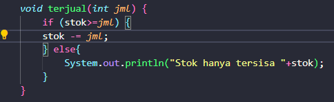

# Laporan Jobsheet 2

Nama : Giovano Alkandri  
Nim : 2341720096  
Kelas : TI-1H

## Percobaan 1

#### Hasil Run Program

Tidak dapat dijalankan karena tidak memiliki class main sehingga tidak memiliki hasil Running.

1. Sebutkan dua karakteristik class atau object!  
   Jawab: Class atau Objek memiliki 2 karakteristik yaitu memiliki Atribut/Variable dan Method/Fungsi.
2. Perhatikan class Buku pada Praktikum 1 tersebut, ada berapa atribut yang dimiliki oleh class Buku? Sebutkan apa saja atributnya!  
   Jawab: Ada 5, judul: String, pengarang: String, halaman: int, stok: int, harga: int.
3. Ada berapa method yang dimiliki oleh class tersebut? Sebutkan apa saja methodnya!  
   Jawab: Ada 4, tampilInformasi(): void, terjual(jml: int): void, restock(n: int): void, gantiHarga(hrg: int): int.
4. Perhatikan method terjual() yang terdapat di dalam class Buku. Modifikasi isi method tersebut sehingga proses pengurangan hanya dapat dilakukan jika stok masih ada (lebih besar dari 0)!  
   Jawab: 
5. Menurut Anda, mengapa method restock() mempunyai satu parameter berupa bilangan int?  
   Jawab: Karena untuk melakukan restock hanya diperlukan jumlah buku nya saja dan berupa ber tipe data int.
6. Commit dan push kode program ke Github
