# Laporan Jobsheet 3

```
Nama : Giovano Alkandri
Nim : 2341720096
Kelas : TI-1H
```

## 3.1 Percobaan 1: Membuat Array dari Object, Mengisi dan Menampilkan

### 3.1.1 Verifikasi Hasil Percobaan

Contoh verivikasi hasil percobaan.

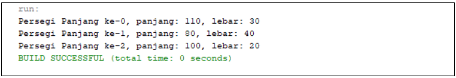

Hasil saya:

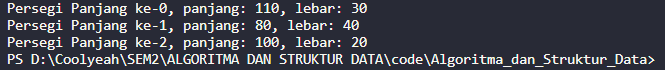

### 3.1.2 Pertanyaan

1.  Berdasarkan uji coba 3.2, apakah class yang akan dibuat array of object harus selalu memiliki
    atribut dan sekaligus method?Jelaskan!
    > Jawab: Untuk atribut wajib dimilikki sedangkan method tidak wajib dimiliki karena agar dapat menyimpan suatu nilai harus memiliki atribut.
2.  Apakah class PersegiPanjang memiliki konstruktor?Jika tidak, kenapa dilakukan pemanggilan
    konstruktur pada baris program berikut :

         ppArray[1] = new PersegiPanjang13();

    > Jawab: Ada, pada tiap class memiliki konstruktor default, namun tidak ditampilkan.

3.  Apa yang dimaksud dengan kode berikut ini:

        PersegiPanjang13[] ppArray = new PersegiPanjang[3];

    > Jawab: Kode tersebut melakukan instansiasi array.

4.  Apa yang dimaksud dengan kode berikut ini:

        ppArray[1] = new PersegiPanjang13();
        ppArray[1].panjang = 80;
        ppArray[1].lebar = 40;

    > Jawab: Kode tersebut melakukan pengisian nilai dalam atribut object array pada index [1].

5.  Mengapa class main dan juga class PersegiPanjang dipisahkan pada uji coba 3.2?
    > Jawab: Karena jika class Main dan class PersegiPanjang13 digabun akan terjadi error (`No enclosing instance of type ArrayObjects13 is accessible. Must qualify the allocation with an enclosing instance of type ArrayObjects13 (e.g. x.new A() where x is an instance of ArrayObjects13)`).

## 3.2 Percobaan 2: Menerima Input Isian Array Menggunakan Looping

### 3.2.1 Verifikasi Hasil Percobaan

Contoh verifikasi hasil percobaan.

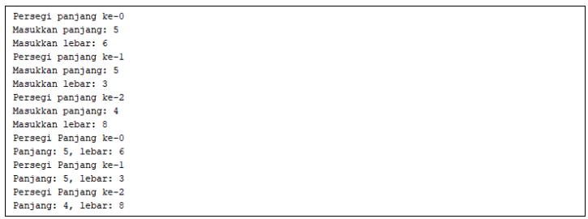

Hasil saya:

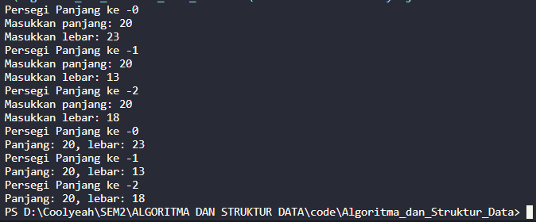

### 3.2.2 Pertanyaan

1.  Apakah array of object dapat diimplementasikan pada array 2 Dimensi?
    > Jawab: array of object 2 dimensi dapat dilakukan karena implementasinya sama dengan implementasi array 1 dimensi, hanya saja ada perbedaan pada index nya.
2.  Jika jawaban soal no satu iya, berikan contohnya! Jika tidak, jelaskan!
    > Jawab: Persegitga[][] ppArray = new Persegitiga[i][j];
3.  Jika diketahui terdapat class Persegi yang memiliki atribut sisi bertipe integer, maka kode
    dibawah ini akan memunculkan error saat dijalankan. Mengapa?

            Persegi[] pgArray = new Persegi[100];
            pgArray[5].sisi = 20;

> Jawab: Error muncul dikarenakan index array belum dipanggil sehingga tidak dapat mengisikan atribut sisi.

4.  Modifikasi kode program pada praktikum 3.3 agar length array menjadi inputan dengan Scanner!

    > Jawab: Kode modifikasi dibawah ini.

            System.out.print("Masukkan banyak Persegi Panjang: ");
            int BnykPP = input.nextInt();

            PersegiPanjang13[] ppArray = new PersegiPanjang13[BnykPP];

            for (int i = 0; i < BnykPP; i++) {
                ppArray[i] = new PersegiPanjang13();
                System.out.println("Persegi Panjang ke -" + i);
                System.out.print("Masukkan panjang: ");
                ppArray[i].panjang = input.nextInt();
                System.out.print("Masukkan lebar: ");
                ppArray[i].lebar = input.nextInt();
            }

            for (int i = 0; i < BnykPP; i++) {
                System.out.println("Persegi Panjang ke -" + i);
                System.out.println("Panjang: " + ppArray[i].panjang + ", lebar: " + ppArray[i].lebar);
            }

5.  Apakah boleh Jika terjadi duplikasi instansiasi array of objek, misalkan saja instansiasi dilakukan pada ppArray[i] sekaligus ppArray[0]?Jelaskan !
    > Jawab: Boleh saja jika ingin memberikan nilai tertentu pada atribut index tertentu, jika hanya duplikasi instansiasi saja tidak akan mempengaruhi nilai hasil dari Scanner.

## 3.3 Penambahan Operasi Matematika di Dalam Method

### 3.3.1 Verifikasi Hasil Percobaan

Contoh verifikasi hasil percobaan.
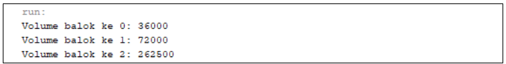  
Hasil saya:  
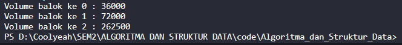

### 3.3.2 Pertanyaan

1.  Dapatkah konstruktor berjumlah lebih dalam satu kelas? Jelaskan dengan contoh!

    > Jawab: Bisa, berikut adalah contoh nya

        public Balok(int p, int l, int t) {
            panjang = p;
            lebar = l;
            tinggi = t;
        }

        public int hitungVolume() {
            return panjang * lebar * tinggi;
        }

2.  Jika diketahui terdapat class Segitiga seperti berikut ini:

        public class Segitiga {
            public int alas;
            public int tinggi;
        }

    Tambahkan konstruktor pada class Segitiga tersebut yang berisi parameter int a, int t
    yang masing-masing digunakan untuk mengisikan atribut alas dan tinggi.

3.  Tambahkan method hitungLuas() dan hitungKeliling() pada class Segitiga
    tersebut. Asumsi segitiga adalah segitiga siku-siku. (Hint: Anda dapat menggunakan bantuan library Math pada Java untuk mengkalkulasi sisi miring)

    > Jawab: Method hitungLuas() dan hitungKeliling() di bawah ini.

        public double hitungLuas() {
            double luas = (double) (1 / 2) * (alas * tinggi);
            return luas;
        }

        public int hitungsisi() {
            sisi = (alas * alas) + (tinggi * tinggi);
            Math.sqrt(sisi);
            return sisi;
        }

        public double hitungKeliling() {
            double keliling = (double) (2 * sisi) + alas;
            return keliling;
        }

4.  Pada fungsi main, buat array Segitiga sgArray yang berisi 4 elemen, isikan masing-masing
    atributnya sebagai berikut:

            sgArray ke-0 alas: 10, tinggi: 4
            sgArray ke-1 alas: 20, tinggi: 10
            sgArray ke-2 alas: 15, tinggi: 6
            sgArray ke-3 alas: 25, tinggi: 10

5.  Kemudian menggunakan looping, cetak luas dan keliling dengan cara memanggil method
    hitungLuas() dan hitungKeliling().

    > Jawab: Hasil running di bawah ini.

    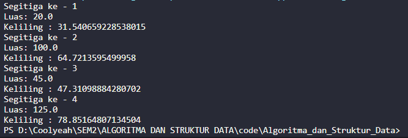

## 3.4 Latihan Praktikum

1.  Buatlah program yang dapat menghitung luas permukaan dan volume bangun ruang kerucut,
    limas segi empat sama sisi, dan bola. Buatlah 3 (tiga) class sesuai dengan jumlah jenis bangun ruang. Buatlah satu main class untuk membuat array of objects yang menginputkan atributatribut yang ada menggunakan konstruktor semua bangun ruang tersebut. Dengan ketentuan,

    - Buat looping untuk menginputkan masing-masing atributnya, kemudian tampilkan
      luas permukaan dan volume dari tiap jenis bangun ruang tersebut.
    - Pada kerucut, inputan untuk atribut hanya jari-jari dan sisi miring
    - Pada limas segi empat sama sisi, inputan untuk atribut hanya panjang sisi alas dan
      tinggi limas
    - Pada bola, inpuntan untuk atribut hanya jari-jari

    #### Hasil Latihan Praktikum 1 : Luas Permukan dan Volume Bangun Ruang.

    1.  Kerucut

        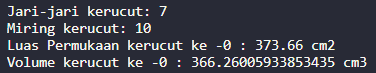

    2.  Limas Segi Empat Sama Kaki

        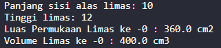

    3.  Bola

        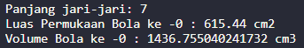

2.  Sebuah kampus membutuhkan program untuk menampilkan informasi mahasiswa berupa nama,
    nim, jenis kelamin dan juga IPK mahasiswa. Program dapat menerima input semua informasi
    tersebut, kemudian menampilkanya kembali ke user. Implementasikan program tersebut jika
    dimisalkan terdapat 3 data mahasiswa yang tersedia. Contoh output program:

         Masukkan data mahasiswa ke- 1
         Masukkan nama :Rina
         Masukkan nim :1234567
         Masukkan jenis kelamin :P
         Masukkan IPK :3.5
         Masukkan data mahasiswa ke- 2
         Masukkan nama :Rio
         Masukkan nim :7654321
         Masukkan jenis kelamin :L
         Masukkan IPK :4.0
         Masukkan data mahasiswa ke- 3
         Masukkan nama :Reza
         Masukkan nim :8765398
         Masukkan jenis kelamin :L
         Masukkan IPK :3.8
         Data Mahasiswa ke-1
         nama : Rina
         nim : 1234567
         Jenis kelamin : P
         Nilai IPK : 3.5
         Data Mahasiswa ke-2
         nama : Rio
         nim : 7654321
         Jenis kelamin : L
         Nilai IPK : 4.0
         Data Mahasiswa ke-3
         nama : Reza
         nim : 8765398
         Jenis kelamin : L
         Nilai IPK : 3.8

    #### Hasil Latihan Praktikum 2 : Data Mahasiswa

    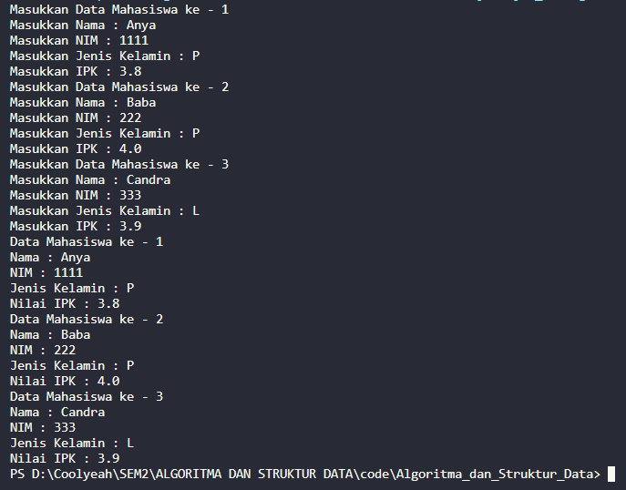

3.  Modifikasi program Latihan no.2 di atas, sehingga bisa digunakan untuk menghitung rata-rata IPK, serta menampilkan data mahasiswa dengan IPK terbesar! (gunakan method untuk masing-masing proses tersebut)

    #### Hasil Latihan Praktikum 3 : Modifikasi Data Mahasiswa

    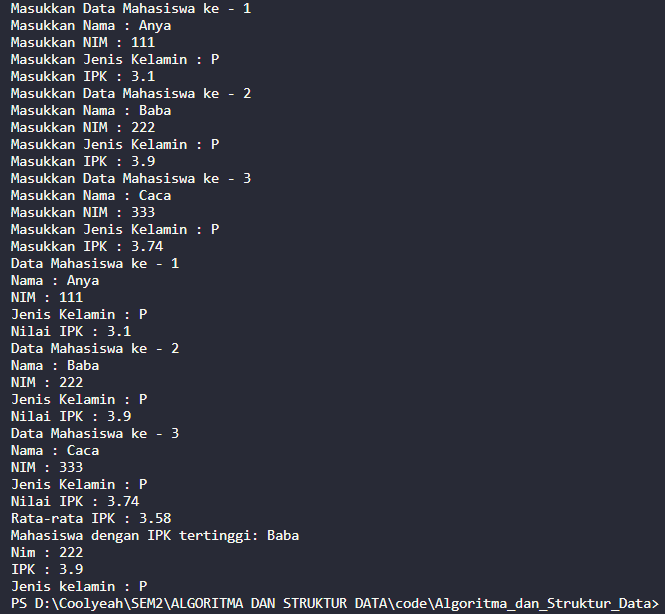
