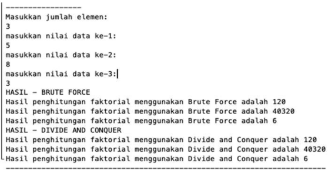
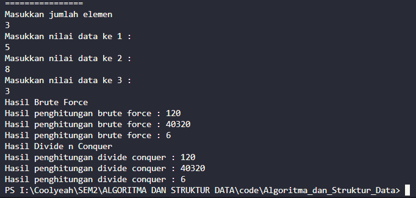
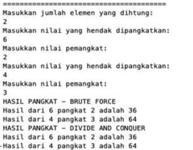
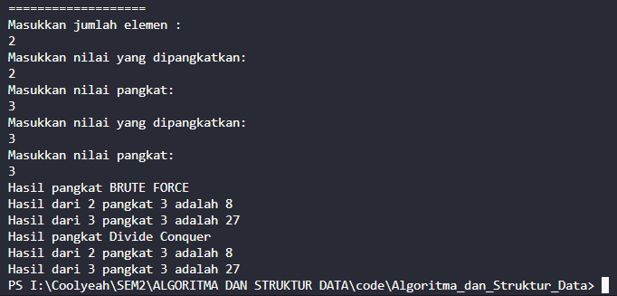
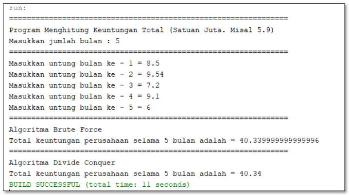
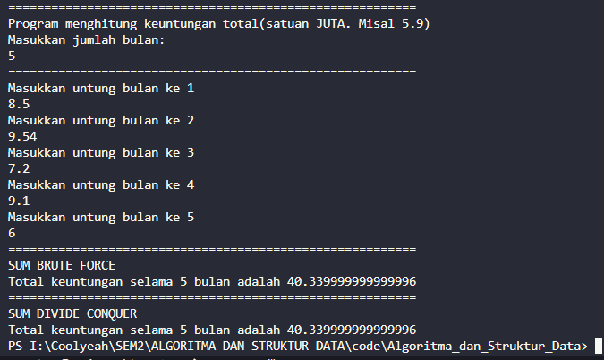
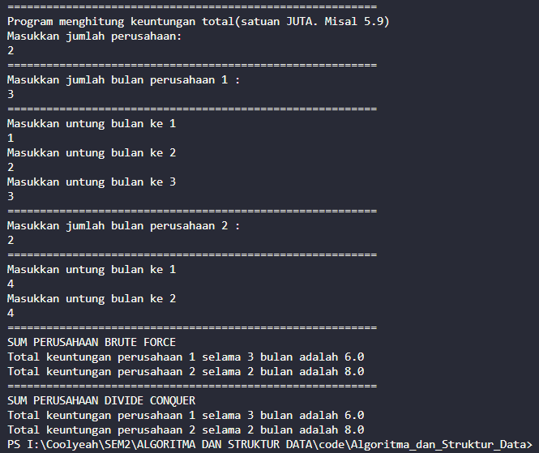

# Laporan Jobsheet 3

```
Nama : Giovano Alkandri
Nim : 2341720096
Kelas : TI-1H
```

## 4.1 Menghitung Nilai Faktorial dengan Algoritma Brute Force dan Divide and Conquer

### 4.1.1 Verifikasi Hasil Percobaan

**Contoh verifikasi hasil percobaan.**



**Hasil Program Faktorial**



4.1.2 Pertanyaan

1.  Pada base line Algoritma Divide Conquer untuk melakukan pencarian nilai faktorial, jelaskan perbedaan bagian kode pada penggunaan if dan else!

          if (n==1) digunakan ketika n bernilai 1, sehingga akan mengembalikan nilai 1.

          else digunakan untuk melakukan operasi faktorial.

2.  Apakah memungkinkan perulangan pada method faktorialBF() dirubah selain menggunakan for?Buktikan!

         Hal tersebut dapat dilakukan, berikut adalah contohnya.

         int faktorialBF(int n){
            int faktor = 1;
            int i = 1;
            while (i<=n){
               faktor *= i
               i++
            }
            return faktor;
         }

3.  Jelaskan perbedaan antara fakto _= i; dan int fakto = n _ faktorialDC(n-1); !

         faktor *= i menjumlahkan perkalian faktor dengan i.

         faktor = n* faktorialDC(n-1) melakukan perkalian rekursif dengan pengurangan di setiap perulangan hingga n == 1

## 4.2 Menghitung Hasil Pangkat dengan Algoritma Brute Force dan Divide and Conquer

### 4.2.1 Verifikasi Hasil Percobaan

**Contoh verifikasi hasil percobaan.**



**Hasil Program Pangkat**



4.2.2 Pertanyaan

1.  Jelaskan mengenai perbedaan 2 method yang dibuat yaitu PangkatBF() dan PangkatDC()!

         PangkatBF() menggunakan metode Brute Force dimana metode ini menggunakan algoritma perulangan untuk menghitung nilai pangkat. Dengan menggunkaan *for*, method ini akan melakukan perkalian dari bilangan *a* sebanyak *n* kali.

         PangkatDC() menggunakan metode Divide Conquer dimana metode ini menggunakan algoritma rekursif untuk menghitung nilai pangkat. Ketika *n* == 0, akan mengembalikan nilai 1. Jika *n* bukan 0, maka akan dilakukan pembagian *n* dengan 2 dan memanggil dirinya sendiri. Jika *n* merupakan bilangan ganjil, maka akan dilakukan perkalian dari hasil pemanggilan method itu sendiri dengan bilangan *a*.

2.  Apakah tahap combine sudah termasuk dalam kode tersebut?Tunjukkan!

         Tahap combine tidak termasuk ke dalam method *pangkatBF()* dan *PangkatDC()*.

3.  Modifikasi kode program tersebut, anggap proses pengisian atribut dilakukan dengan konstruktor.

         public Pangkat(int nilai, int pangkat){
            this.nilai = nilai;
            this.pangkat = pangkat;
         }

4.  Tambahkan menu agar salah satu method yang terpilih saja yang akan dijalankan menggunakan switch-case!

         System.out.println("Pilih \n 1. Brute Force \n 2. Divide Conquer");
         int pilih = input.nextInt();
         input.nextLine();

         switch (pilih) {
               case 1:
                  System.out.println("Hasil pangkat BRUTE FORCE");
                  for (int i = 0; i < elemen; i++) {
                     System.out.println("Hasil dari " +
                              png[i].nilai + " pangkat " +
                              png[i].pangkat + " adalah " +
                              png[i].PangkatBF(png[i].nilai, png[i].pangkat));
                  }
                  break;
               case 2:
                  System.out.println("Hasil pangkat Divide Conquer");
                  for (int i = 0; i < elemen; i++) {
                     System.out.println("Hasil dari " +
                              png[i].nilai + " pangkat " +
                              png[i].pangkat + " adalah " +
                              png[i].PangkatDC(png[i].nilai, png[i].pangkat));
                  }
                  break;

               default:
                  break;
         }

## 4.3 Menghitung Sum Array dengan Algoritma Brute Force dan Divide and Conquer

### 4.3.1 Verifikasi Hasil Percobaan

**Contoh verifikasi hasil percobaan.**



**Hasil Program Sum**



4.4.3 Pertanyaan

1.  Mengapa terdapat formulasi return value berikut?Jelaskan!

    `return lsum + rsum + arr[mid];`

          Kode tersebut digunakan untuk mengembalikan total nilai sum dari method totalDC

2.  Kenapa dibutuhkan variable mid pada method TotalDC()?

    Variable mid digunakan untuk menentukan index tengah dari total elemen

3.  Program perhitungan keuntungan suatu perusahaan ini hanya untuk satu perusahaan saja. Bagaimana cara menghitung sekaligus keuntungan beberapa bulan untuk beberapa perusahaan.(Setiap perusahaan bisa saja memiliki jumlah bulan berbeda-beda)? Buktikan dengan program!

         Berikut adalah program dengan beberapa perusahaan

```
     System.out.println("=========================================================");
     System.out.println("Program menghitung keuntungan total(satuan JUTA. Misal 5.9)");
     System.out.println("Masukkan jumlah perusahaan: ");
     int company = input.nextInt();
     input.nextLine();

     Sum[] cmp = new Sum[company];

     for (int i = 0; i < company; i++) {
         System.out.println("=========================================================");
         System.out.println("Masukkan jumlah bulan perusahaan " + (i + 1) + " : ");
         int bln = input.nextInt();
         input.nextLine();
         cmp[i] = new Sum(bln, company);
         cmp[i].perusahaan = bln;
         System.out.println("=========================================================");
         for (int j = 0; j < bln; j++) {
             System.out.println("Masukkan untung bulan ke " + (j + 1));
             cmp[i].keuntungan[j] = input.nextDouble();
             input.nextLine();
         }
     }

     System.out.println("=========================================================");
     System.out.println("SUM PERUSAHAAN BRUTE FORCE");
     for (int i = 0; i < company; i++) {
         System.out.println("Total keuntungan perusahaan " + (i + 1) + " selama " + cmp[i].elemen + " bulan adalah "
                 + cmp[i].totalBF(cmp[i].keuntungan));
     }
     System.out.println("=========================================================");
     System.out.println("SUM PERUSAHAAN DIVIDE CONQUER");
     for (int i = 0; i < company; i++) {
         System.out.println("Total keuntungan perusahaan " + (i + 1) + " selama " + cmp[i].elemen + " bulan adalah "
                 + cmp[i].totalDC(cmp[i].keuntungan, 0, cmp[i].elemen - 1));
     }
```

**Berikut adlaah hasil Running kode program**


