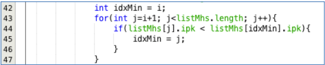

# Laporan Jobsheet 5

```
Nama : Giovano Alkandri
Nim : 2341720096
Kelas : TI-1H
```

## 5.1 Mengurutkan Data Mahasiswa Berdasarkan IPK Menggunakan Bubble Sort

### 5.1.1 Verifikasi Hasil Percobaan

**Contoh verifikasi hasil percobaan**

 

**Hasil Program**

 

### 5.1.2 Pertanyaan

1.  Terdapat di method apakah proses bubble sort?

        Proses bubble sort terdapat di method void bubbleSort()

2.  Di dalam method bubbleSort(), terdapat baris program seperti di bawah ini:  
       
    Untuk apakah proses tersebut?

        Proses tersebut digunakan untuk melakukan pertukaran nilai dalam array

3.  Perhatikan perulangan di dalam bubbleSort() di bawah ini:  
       
    a. Apakah perbedaan antara kegunaan perulangan i dan perulangan j?

        perulangan i digunakan untuk melakukan iterasi ke seluruh elemen array, mulai dari index pertama hingga index terakhir.

        perulangan j digunakan membandingkan dan memanipulasi elemen yang sedang dibandingakan, yaitu elemen indeks sebelumnya dan indeks saat ini.

    b. Mengapa syarat dari perulangan i adalah i<listMhs.length-1 ?

        karena kita tidak perlu membandngkan elemen terakhir dengan elemen yang lebih rendah, sehingga dapat mengurangi perulangan yang tidak diperlukan.

    c. Mengapa syarat dari perulangan j adalah j<listMhs.length-i ?

        karena pada setiap iterasi 'i' tidak perlu memeriksa 'listmhs[ i ]' karena elemen tsb sudah tersortir. karenanya panjang array yang dilakukan oleh perulangan 'j' akan semakin kecil karena kita telah mengurutkan sebagian elemen dari array itu sendiri.

    d. Jika banyak data di dalam listMhs adalah 50, maka berapakali perulangan i akan berlangsung? Dan ada berapa Tahap bubble sort yang ditempuh?

        perulangan i akan dilakukan sebanyak 49 kali karena (i<50-1), dan ada 49 tahap yang ditempuh buble sort.

## 5.2 Mengurutkan Data Mahasiswa Berdasarkan IPK Menggunakan Selection Sort

### 5.2.1 Verifikasi Hasil Percobaan

**Contoh verifikasi hasil percobaan**

 

**Hasil Program**

 

### 5.2.2 Pertanyaan

Di dalam method selection sort, terdapat baris program seperti di bawah ini:  
  
Untuk apakah proses tersebut, jelaskan!

        kode tersebut digunakan untuk mencari indeks dari elemen terkecil yang masih belum tersortir pada setiap iterasi dari perulangan 'i'

## 5.3 Mengurutkan Data Mahasiswa Berdasarkan IPK Menggunakan Insertion Sort

### 5.3.1 Verifikasi Hasil Percobaan

**Contoh verifikasi hasil percobaan**

 

**Hasil Program**

 

### 5.3.2 Pertanyaan

Ubahlah fungsi pada InsertionSort sehingga fungsi ini dapat melaksanakan proses sorting dengan cara descending.

```
    void insertionSortDesc() {
        for (int i = 1; i < listMhs.length; i++) {
            Mahasiswa temp = listMhs[i];
            int j = i;
            while (j > 0 && listMhs[j - 1].ipk < temp.ipk) {
                listMhs[j] = listMhs[j - 1];
                j--;
            }
            listMhs[j] = temp;
        }
    }

```


## 5.4 Latihan Praktikum


1. Sorting Harga


2. Sorting Rating


