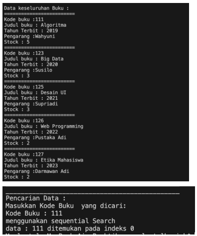
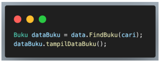
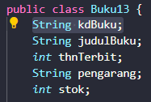
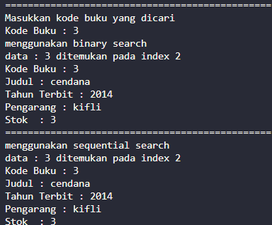
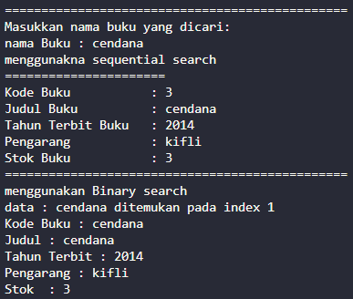
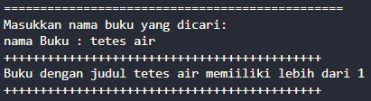

# Laporan Jobsheet 6

```
Nama : Giovano Alkandri
Nim : 2341720096
Kelas : TI-1H
```

## 6.1 Searching / Pencarian Menggunakan Agoritma Sequential Search

### 6.1.1 Verifikasi Hasil Percobaan

**Contoh verifikasi hasil percobaan**

 

**Hasil Program**

**Jika data ditemukan:**


**Jika data tidka ditemukan:**


### 6.1.2 Pertanyaan

1.  Jelaskan fungsi break yang ada pada method FindSeqSearch!

        fungsi break digunakan untuk keluar dari perulangan jika data telah ditemukan.

2.  Jika Data Kode Buku yang dimasukkan tidak terurut dari kecil ke besar. Apakah program masih dapat berjalan? Apakah hasil yang dikeluarkan benar? Tunjukkan hasil screenshoot untuk bukti dengan kode Buku yang acak. Jelaskan Mengapa hal tersebut bisa terjadi?

        program tetap berjalan dan hasil yang dikeluarkan benar karena metode pencarian dilakukan dengan mencocokkan data yang ada, jika data cocok maka pencarian berhenti.

     

3.  Buat method baru dengan nama FindBuku menggunakan konsep sequential search dengan tipe method dari FindBuku adalah BukuNoAbsen. Sehingga Anda bisa memanggil method tersebut pada class BukuMain seperti gambar berikut :  
    

    ```
    Buku13 findbuku(String find) {
        int awal = -1;
        for (int i = 0; i < listBk.length; i++) {
            if (find.equalsIgnoreCase(listBk[i].judulBuku)) {
                awal = i;
                break;
            }
        }
        return listBk[awal];
    }
    ```

    

## 6.2 Searching / Pencarian Menggunakan Binary Search

### 6.2.1 Verifikasi Hasil Percobaan

**Contoh verifikasi hasil percobaan**


**Hasil Program**

 

### 6.2.2 Pertanyaan

1.  Tunjukkan pada kode program yang mana proses divide dijalankan!

    

2.  Tunjukkan pada kode program yang mana proses conquer dijalankan!

    

3.  Jika data Kode Buku yang dimasukkan tidak urut. Apakah program masih dapat berjalan? Mengapa demikian! Tunjukkan hasil screenshoot untuk bukti dengan kode Buku yang acak. Jelaskan Mengapa hal tersebut bisa terjadi?

        Program tetap dapat dijalankan tanpa ada masalah.

     

4.  Jika Kode Buku yang dimasukkan dari Kode Buku terbesar ke terkecil (missal : 20215, 20214, 20212, 20211, 20210) dan elemen yang dicari adalah 20210. Bagaimana hasil dari binary search? Apakah sesuai? Jika tidak sesuai maka ubahlah kode program binary seach agar hasilnya sesuai!

        Hasil yang dikeluarkan tidak sesuai karena kode belum memenuhi metode binary search yang harus dilakukan sorting terlebih dahulu. Dibawah ini adalah kode inertion Sort yang digunkaan untuk melakukan sorting pada metode binary search

```
    void insertionSortAsc() {
        for (int i = 1; i < listBk.length; i++) {
            Buku13 temp = listBk[i];
            int j = i;
            while (j > 0 && listBk[j - 1].kdBuku > temp.kdBuku) {
                listBk[j] = listBk[j - 1];
                j--;
            }
            listBk[j] = temp;
        }
    }
```

## 6.3 Percobaan Pengayaan Divide and Conquer

### 6.3.1 Verifikasi Hasil Percobaan Percobaan Merge Sort

**Contoh verifikasi hasil percobaan**


**Hasil Program Percobaan Merge Sort**


## 6.4 Latihan Praktikum

1.  Modifikasi percobaan searching diatas dengan ketentuan berikut ini

    - Ubah tipe data dari kode Buku yang awalnya int menjadi String

      

    - Tambahkan method untuk pencarian kode Buku (bertipe data String) dengan menggunakan sequential search dan binary search.

      Kode Buku dengan Sequential Search

            int findseqSearch(String find) { // kdBuku String
                int awal = -1;
                for (int i = 0; i < listBk.length; i++) {
                    if (find.equalsIgnoreCase(listBk[i].kdBuku)) {
                        awal = i;
                        break;
                    }
                }
                return awal;
            }

      Kode Buku dengan Binary Search

            void StrInsertionSortAsc() {
                for (int i = 1; i < listBk.length; i++) {
                    Buku13 temp = listBk[i];
                    int j = i;
                    while (j > 0 && listBk[j - 1].kdBuku.compareTo(temp.kdBuku) > 0) {
                        listBk[j] = listBk[j - 1];
                        j--;
                    }
                    listBk[j] = temp;
                }
            }

            public int StrFindBinarySearch(String cari, int l, int r) {
                int m;
                if (r >= l) {
                    m = (l + r) / 2;
                    if (cari.equalsIgnoreCase(listBk[m].kdBuku)) {
                        return m;
                    } else if (cari.compareTo(listBk[m].kdBuku) < 0) {
                        return StrFindBinarySearch(cari, l, m - 1);
                    } else {
                        return StrFindBinarySearch(cari, m + 1, r);
                    }
                }
                return -1;
            }

      ### Hasil Kode

      

2.  Modifikasi percobaan searching diatas dengan ketentuan berikut ini

    - Tambahkan method pencarian judul buku menggunakan sequential search dan binary search. Sebelum dilakukan searching dengan binary search data harus dilakukan pengurutan dengan menggunakan algoritma Sorting (bebas pilih algoritma sorting apapun)! Sehingga ketika input data acak, maka algoritma searching akan tetap berjalan

      Judul Buku dengan Sequential Search

            Buku13 findbuku(String find) {
                int awal = -1;
                for (int i = 0; i < listBk.length; i++) {
                    if (find.equalsIgnoreCase(listBk[i].judulBuku)) {
                        awal = i;
                        break;
                    }
                }
                return listBk[awal];
            }

      Judul Buku dengan Binary Search

            void StrInsertionSortJudulAsc() {
                for (int i = 1; i < listBk.length; i++) {
                    Buku13 temp = listBk[i];
                    int j = i;
                    while (j > 0 && listBk[j - 1].judulBuku.compareTo(temp.judulBuku) > 0) {
                        listBk[j] = listBk[j - 1];
                        j--;
                    }
                    listBk[j] = temp;
                }
            }

            public int StrFindBukuBinary(String cari, int l, int r) {
                int m;
                if (r >= l) {
                    m = (l + r) / 2;
                    if (cari.compareToIgnoreCase(listBk[m].judulBuku) == 0) {
                        return m;
                    } else if (cari.compareToIgnoreCase(listBk[m].judulBuku) < 0) {
                        return StrFindBukuBinary(cari, l, m - 1);
                    } else {
                        return StrFindBukuBinary(cari, m + 1, r);
                    }
                }
                return -1;
            }

      ### Hasil Kode

      

    - Buat aturan untuk mendeteksi hasil pencarian judul buku yang lebih dari 1 hasil dalam bentuk kalimat peringatan! Pastikan algoritma yang diterapkan sesuai dengan kasus yang diberikan!

            public int judulDobel(String cari) {
                int hitung = 0;
                for (int i = 0; i < listBk.length; i++) {
                    if (listBk[i].judulBuku != null && listBk[i].judulBuku.equalsIgnoreCase(cari)) {
                        hitung++;
                    }
                }
                return hitung;
            }

      ### Hasil Kode

      
