# Laporan Jobsheet 7

```
Nama : Giovano Alkandri
Nim : 2341720096
Kelas : TI-1H
```

## Percobaan 1: Penyimpanan Tumpukan Barang dalam Gudang

### 7.1.1 Verifikasi Hasil Percobaan

**Contoh verifikasi hasil percobaan**

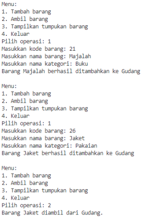 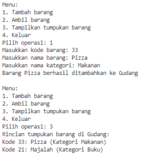

**Hasil Program**

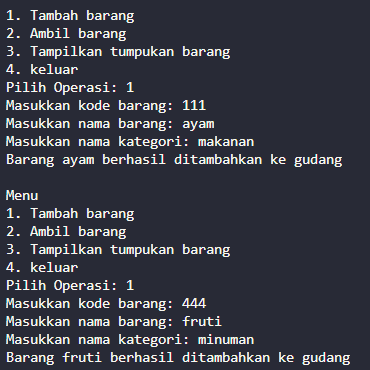 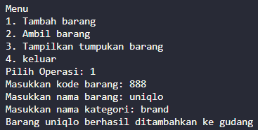  

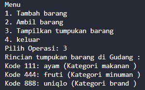  

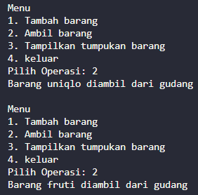


### 7.1.2 Pertanyaan

1. Lakukan perbaikan pada kode program, sehingga keluaran yang dihasilkan sama dengan verifikasi hasil percobaan! Bagian mana saja yang perlu diperbaiki?  

        Bagian yang perlu diperbaiki ada pada 
        
        kode method lihatBarangTeratas(). Seharusnya pada baris kedua bukan if (!isEmpty()), tapi if (!cekKosong())

        dan public void tampilkanBarang(). Seharusnya pada baris kelima bukan  for (int i = 0; i < top; i++), tapi  for (int i = 0; i < top+1; i++)


2. Berapa banyak data barang yang dapat ditampung di dalam tumpukan? Tunjukkan potongan kode programnya!

        Data barang yang dapat ditampung dalma tumpukan adalah 7 data barang  
        Kode ada pada class main, kode tersebut adalah: 
        Gudang13 gudang = new Gudang13(7);

3. Mengapa perlu pengecekan kondisi !cekKosong() pada method tampilkanBarang? Kalau kondisi tersebut dihapus, apa dampaknya?

        Pengecekan kondisi tersebut perlu dilakukan agar data barang yang diinput tidak overload. Jika kondisi tersebut dihapus akan berdampak pada kode yang lainnya sehingga akan menghasilkan error

4. Modifikasi kode program pada class Utama sehingga pengguna juga dapat memilih operasi lihat barang teratas, serta dapat secara bebas menentukan kapasitas gudang!  

        Kode mementukan kapasitas gudang : 

        System.out.print("Masukkan Kapasitas Gudang : ");
        int cap = scanner.nextInt();
        scanner.nextLine();
        Gudang13 gudang = new Gudang13(cap);

        Kode melihat barang teratas: 

        gudang.lihatBarangTeratas();
          

5. Commit dan push kode program ke Github


## Percobaan 2: Konversi Kode Barang ke Biner

### 7.2.1 Verifikasi Hasil Percobaan

**Contoh verifikasi hasil percobaan**

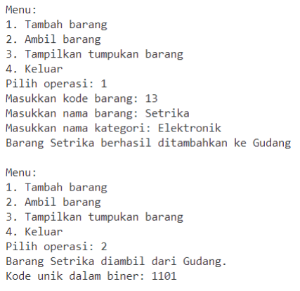

**Hasil Program**

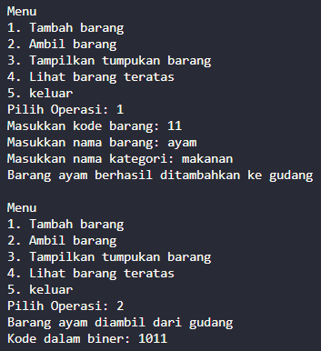

### 7.2.2 Pertanyaa

1. Pada method konversiDesimalKeBiner, ubah kondisi perulangan menjadi while (kode != 0), bagaimana hasilnya? Jelaskan alasannya!  

        Tidak terjadi perubahan. Karena selama kode tidak sama dengan 0, program akan berjalan dengan normal, karena tidak mungkin jika sebuah kode adalah kurang dari dan sama dengan 0.

2. Jelaskan alur kerja dari method konversiDesimalKeBiner!  

        Alur pertama yaitu, hasil pembagian kode dengan 2 akan disimpan di objek stack. lalu perulangan while akan dijalankan selama kode !=0 atau >0, pada setiap iterasi, nilai sisa hasil bagi akan disimpan dalam variable sisa, nilai sisa tersebut kemudian ditambahkan(push) ke dalam tumpukan stack menggunakan method stack.push(sisa), nilai variable kode akan diganti dengan hasil bagi kode dengan 2. Lalu perulangan while lainnya akan dijalankan selama stack tidak kosong, pada setiap iterasi index tertinggi stack diambil menggunakan method pop, nilai tersebut ditambahkan ke biner sebagai representasi biner. setelah perulangan selesai biner akan berisi nilai biner dari kode. selanjutnya variable biner akan di return.

## Percobaan Percobaan 3: Konversi Notasi Infix ke Postfix

### 7.2.1 Verifikasi Hasil Percobaan

**Contoh verifikasi hasil percobaan**

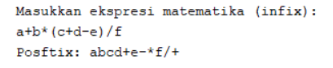

**Hasil Program**

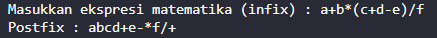

### 7.2.2 Pertanyaa

1. Pada method derajat, mengapa return value beberapa case bernilai sama? Apabila return value diubah dengan nilai berbeda-beda setiap case-nya, apa yang terjadi?  

        Beberapa case bernilai sama karena dalam operasi matematika memiliki prioritas tertentu, seperti perkalian dan pembagian didahulukan daripada pengurangan dan penjumlahan. Jika return value diubah dengan nilai yang berbeda, hasil dari notasi postfix nya juga akan berbeda.

2. Jelaskan alur kerja method konversi!  

        Pada setiap iterasi, fungsi  membaca semua karakter  ekspresi masukan q. 
        Jika karakternya adalah operan, karakter tersebut ditambahkan ke  string yang dihasilkan p. 
        Jika karakternya adalah tanda kurung terbuka, karakter tersebut akan dimasukkan ke dalam tumpukan. 
        Jika karakternya adalah tanda kurung kanan, semua operator  akan dicetak ke tumpukan hingga  tanda kurung kiri yang sesuai ditemukan.
        Jika karakternya adalah operator, operator dengan tingkat prioritas yang sama atau lebih tinggi akan dicetak pada tumpukan. 
        Hasil akhir postfix akan direturn.


3. Pada method konversi, apa fungsi dari potongan kode berikut?  
        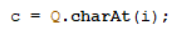  

        kode tersebut digunakan untuk mengambil karakter dari variabel q pada indeks i dan meyimpannya dalam variabel c

## 7.4 Latihan Praktikum

Perhatikan dan gunakan kembali kode program pada Percobaan 1. Tambahkan dua method berikut pada class Gudang:  

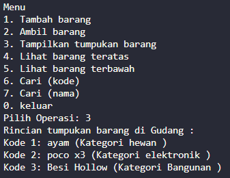

- Method lihatBarangTerbawah digunakan untuk mengecek barang pada tumpukan terbawah  

```
    public Barang13 lihatBarangTerbawah(){
        if (!cekKosong()) {
            Barang13 barangBawah = tumpukan[0];
            System.out.println("Barang terbawah : " + barangBawah.nama);
                    return barangBawah;
        }else{
            System.out.println("Tumpukan barang kosong");
            return null;
        }
    }  
```
            
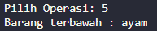

- Method cariBarang digunakan untuk mencari ada atau tidaknya barang berdasarkan kode barangnya atau nama barangnya

```
    public void cariKode(int kd) {
        int a = -1;
        for (int i = 0; i < tumpukan.length; i++) {
            if (kd == tumpukan[i].kode) {
                a = i;
                break;
            }
        }
        if (a == -1) {
            System.out.println("Gaada");
        } else {
            System.out.println("Detail informasi dari kode barang " + kd);
            System.out.println("Nama barang: " + tumpukan[a].nama);
            System.out.println("Kategori barang: " + tumpukan[a].kategori);
        }

    }
```  

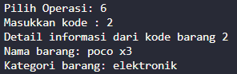  

```
    public void cariNama(String cari) {
        int a = -1;
        for (int i = 0; i < tumpukan.length; i++) {
            if (cari.equalsIgnoreCase(tumpukan[i].nama)) {
                a = i;
                break;
            }
        }
        if (a == -1) {
            System.out.println("Gaada");
        } else {
            System.out.println("Detail informasi dari kode barang " + cari);
            System.out.println("Kode barang: " + tumpukan[a].kode);
            System.out.println("Kategori barang: " + tumpukan[a].kategori);
        }
    }

```  
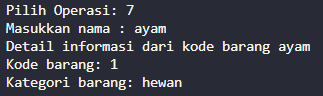

